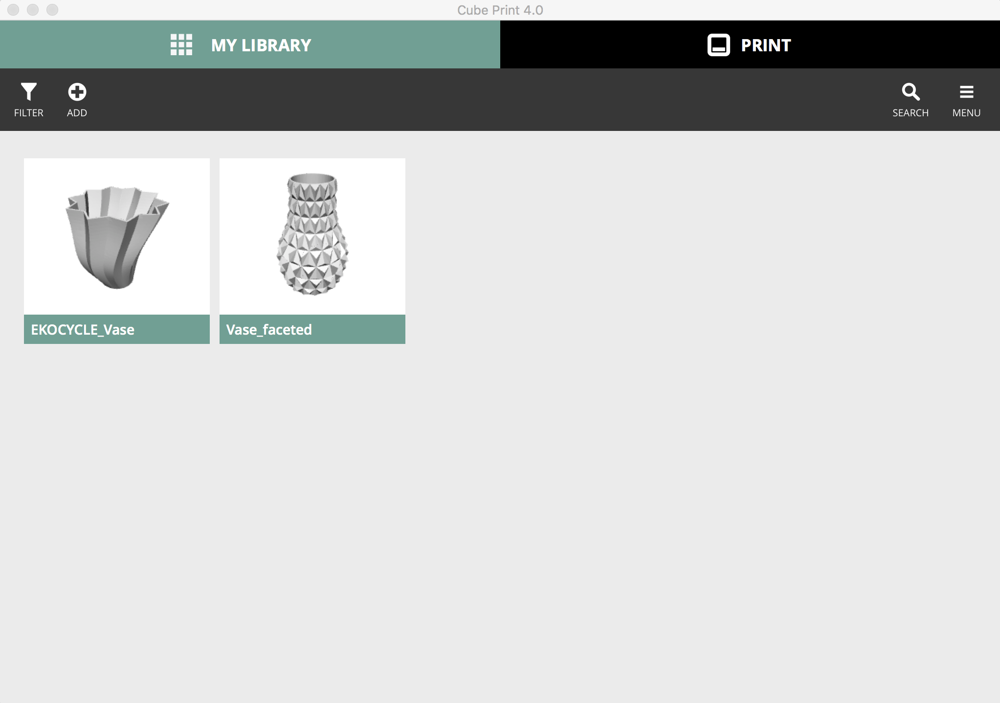
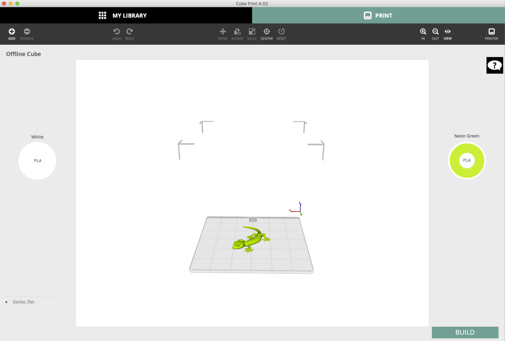
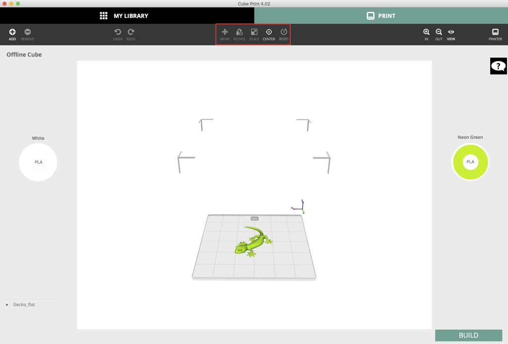
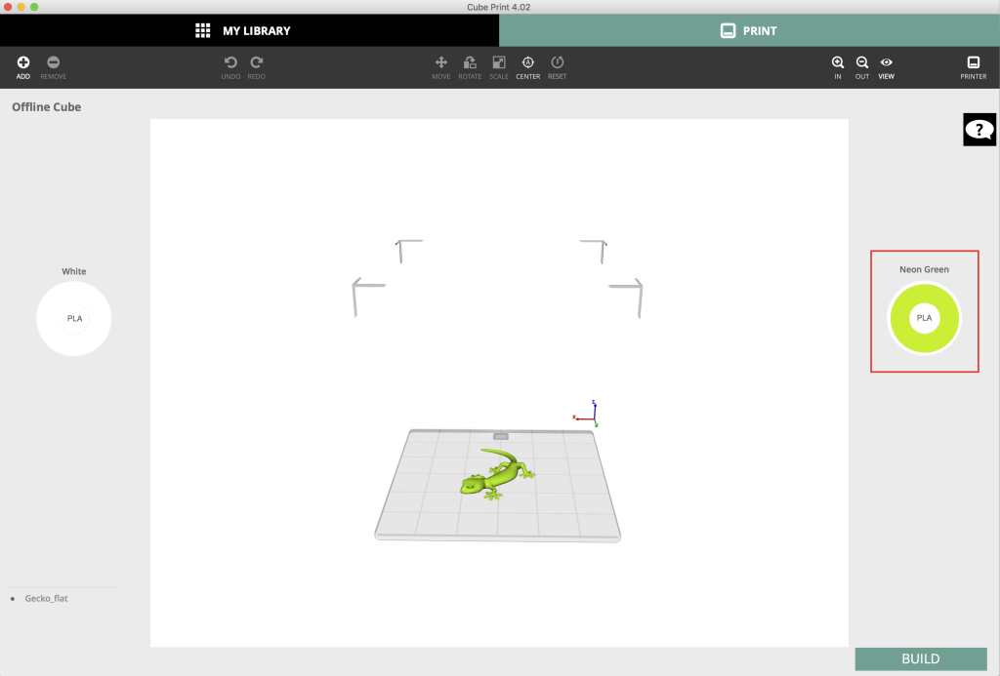

# 3D Printer

The Cube uses the program Cube Print to manage the printing process. It is already downloaded and installed on the iMac in the Device Lab, but if you would like to use your own computer, you can install Cube Print [here](http://www.3dsystems.com/shop/support/cube/downloads). 

1. **Open a design in Cube Print.** The cube uses .stl files which you can find on websites like [Thingiverse](http://www.thingiverse.com/) and [Pinshape](https://pinshape.com/). Download a design and add the .stl file to the program.

2. **Select the printer.** Make sure you're on the Knight Lab wifi and not the Northwestern wifi. Once you're on the Knight Lab wifi, Cube Print will automatically detect the printer (called Huey). If it doesn't automatically connect, select Printer and click "Refresh" next to "Find cubes on network", and select Huey.

3. **View the design in 3-D.** Click and drag your mouse or use the buttons at the top of the window-- to explore the design from various angles and positions. You can even adjust where on the printing plate the design will be placed.

4. **Choose the color.** Once the printer is selected, choose the color to print your design in. To select a color, drag and drop the color cartridge onto the design. Two-color designs take much longer to print, so stick to one color if you can.

5. **Choose the settings.** Click "Build" to choose properties of your design, such as density and structure. Once you're ready, click "print"

6. **Apply glue to the printing plate.** Squeeze the bottle and create a layer of vertical strokes that cover the entire plate. Repeat the same with horizontal strokes but without squeezing the bottle to create an evenly spread layer of glue. [Here's a video](http://www.3dsystems.com/shop/support/cube/videos).
Return the plate to the printer. It attaches magnetically.

7. **Print the design.** Once you've applied the glue, put the printing plate back into the printer and click "OK". Your design will start to print and the printer will give you the estimated time it'll take to complete it.

8. **Remove the design.** Once your design has finished printing, remove the plate and soak it in warm water for a few minutes to loosen the design from the plate. Use the scaper to gently remove the design taking care not to scratch the plate.
Rinse off the rest of the glue from the plate, dry thoroughly and place it back in the printer.
Depending on the density of your design, your model may have some water inside it.

