# Ambisonic Mic

### How to set up the mic

The TetraMic has several cords and steps to set up that seem scary at first, but it is very straightforward! This section will guide you through the process with pictures. 

1. **Locate the TetraMic.** Find the port on the bottom.                 
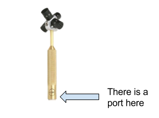

2. **Attach the adapter cable.**
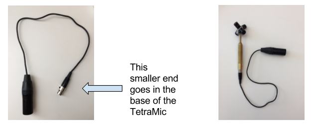

3. **Attach the transmitter.**
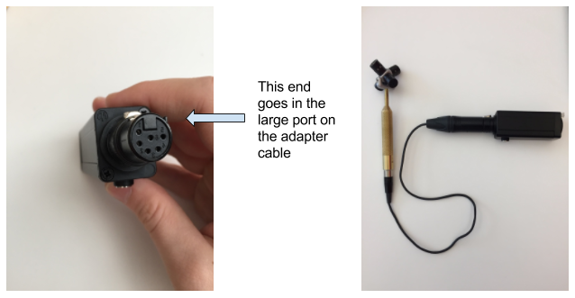

4. **Attach the CAT5e/CAT6 cable.** They must be shielded for the mic to work! CAT6 cables are always shielded but CAT5e cables are sometimes not shielded. We recommend always using CAT6
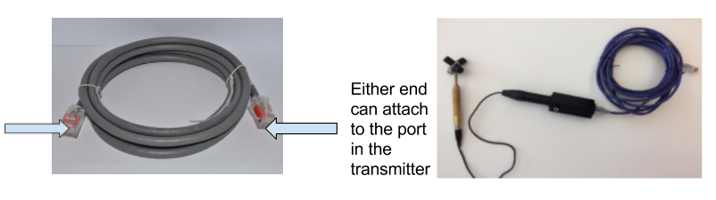

5. **Attach the receiver.**                                
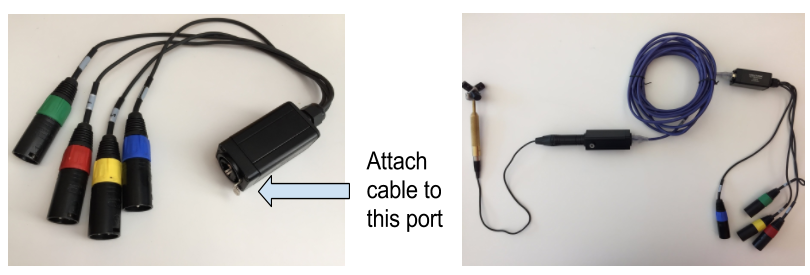

6. **Connect receiver to recorder.** Match the colors on the four cables of the receiver to the color labels on the four ports in the recorder
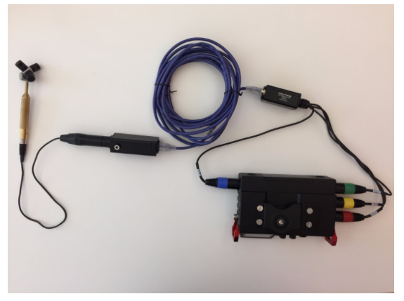

### How to record with the mic

Congratulations, you have set up the TetraMic! Now you want to record. This process can also seem daunting, but the below guide should make it very simple. It is important to note that while the TetraMic does record in 360 degrees, it still has a 'front' which is important for editing purposes. This front is indicated by the etched 'Core' logo on the bronze handle of the microphone.

1. **Make sure all levels on the four dials on the front are equal.** You can adjust the gain depending on how loud your subject is, but make sure to keep all the tracks equal.
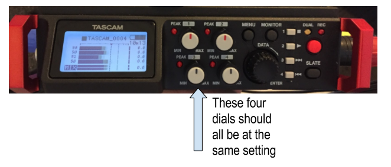

2. **Turn the recorder on.** Push the switch on the right side up.
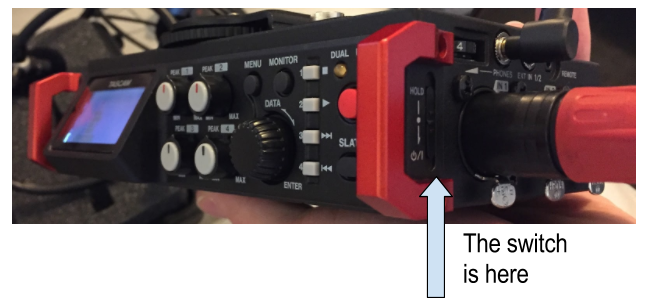

3. **Black navigation dial.** You will be prompted to push enter. Push the big round black dial.
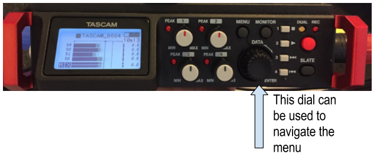

4. **Supply mic power.** Go to menu by navigating with the same black dial - scroll until you find a screen that says ‘Mic Power’ (page 7/18). Scroll through phantom power, and make sure phantom power is on for all four channels. Voltage should be at 48V for each. 
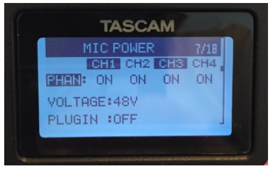

5. **Adjust recording settings.** Under ‘Rec Settings’ (page 9/18) the file type should be ‘Stereo’
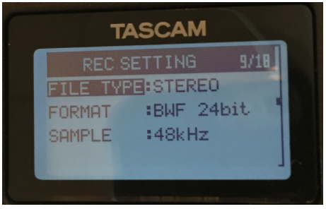

6. **Start recording.** Push the big red button to start recording. While recording, the red light should be on.                                             
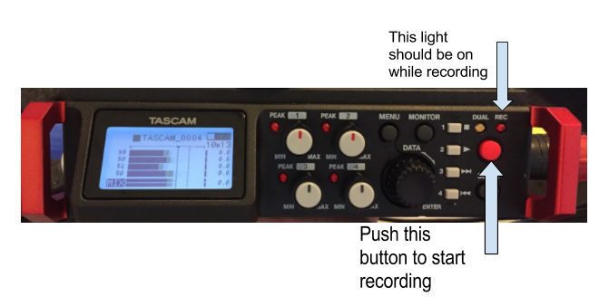

7. **Stop recording.** Press the button labeled '1' to stop recording.
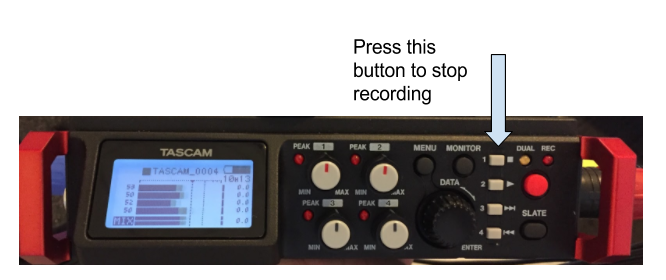

### How to edit your recordings

Again, congratulations! You have now recorded with the TetraMic and want to edit the sound. This process can be tricky, but seems harder than it actually is. For all of the below processes, be sure you are using the main PC in the Device Lab.

1. **Getting files off the recorder.** Connect the recorder to the computer using...

COMING SOON!