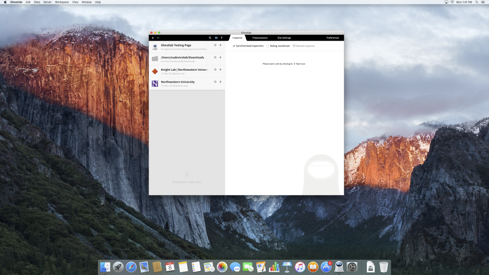
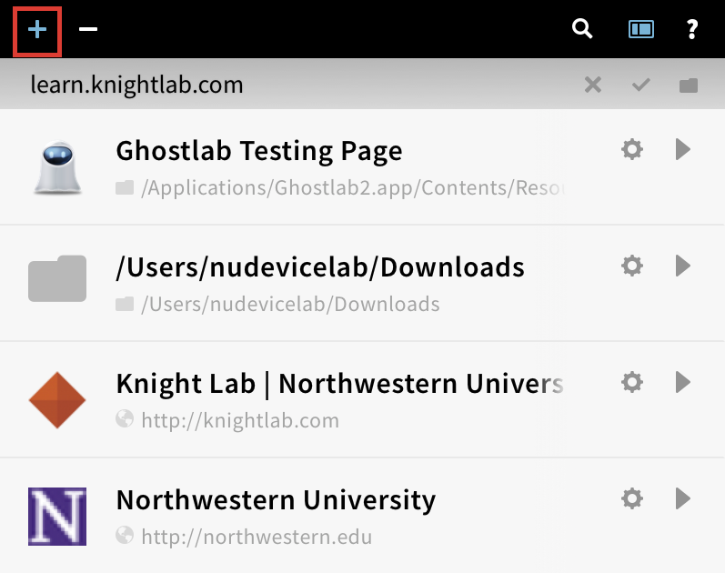
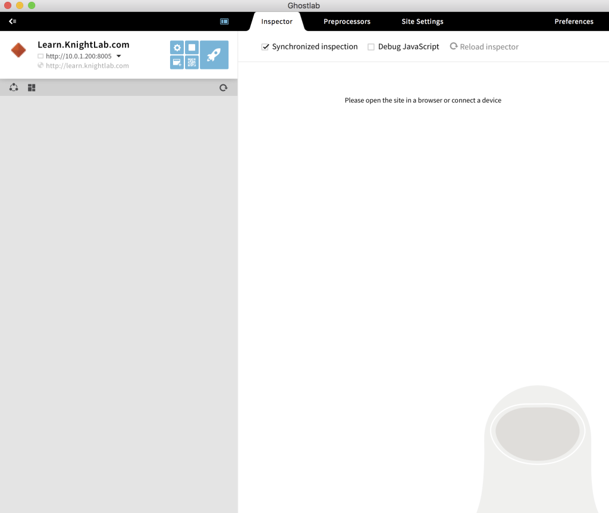
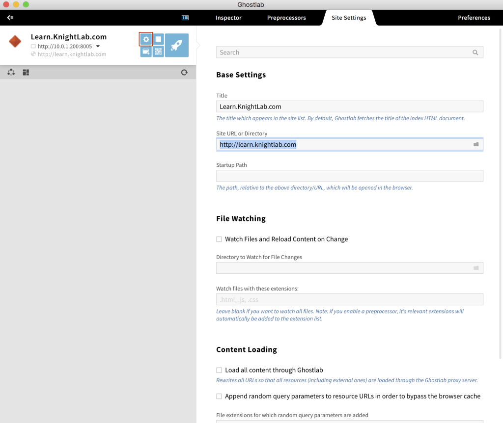
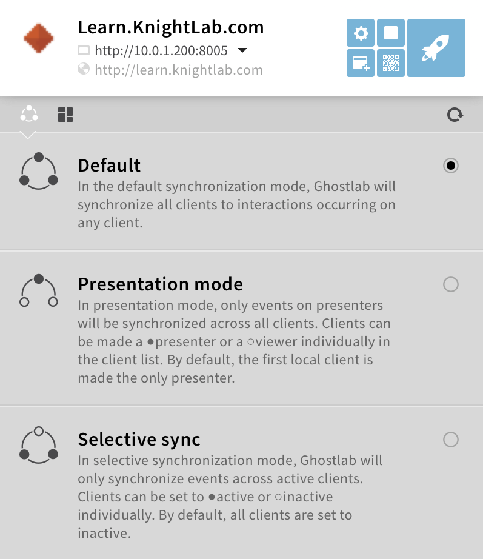
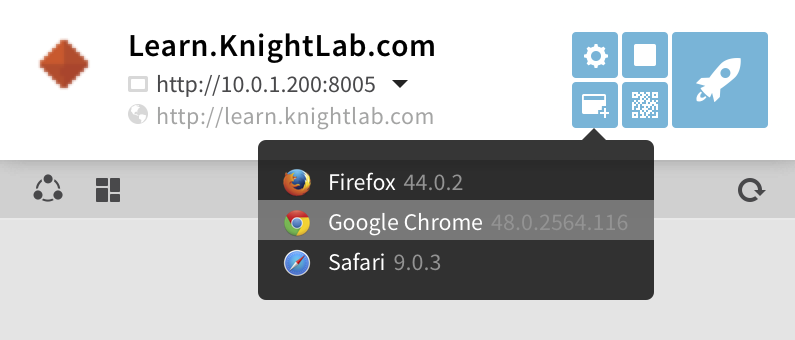
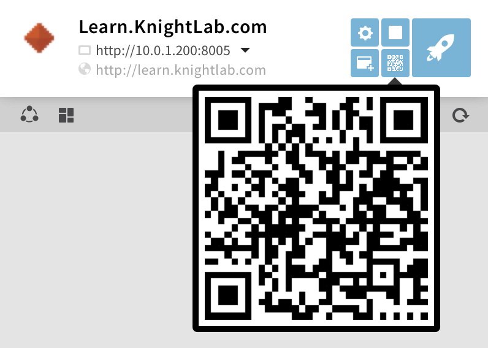
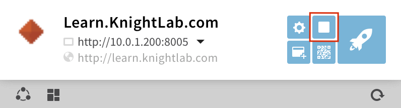

# Mobile Device Suite / Ghost Lab

### How to use devices

1. Devices should only ever be connected to the 'Device Lab' Wi-Fi network (password 'AppleTVs'). If, for any reason, a device is connected to another network, please make the device forget it when you are done.

2. Make sure to sign out any device you take out of the Device Lab (even if it is just into 109B, the conference room, or across the hall).

3. Practice good information security when using these shared devices. Use Incognito Windows or Private Browsing when possible and sign out of your email!

4. Once you have finished using the device, sign it back in, plug it in and put it back on the wall, and fill out our short survey (open on the Mac desktop computer in the Device Lab).

### List of devices

Tablets:
- Surface Pro
- iPad
- Galaxy Tab S
- Nexus 9
- Fire

Phones:
- Google Pixel
- Galaxy S6
- Galaxy S7 Edge
- mystery Windows phone
- Nexus 6
- iPhone 7 Plus
- iPhone 6S Plus
- iPhone 6
- iPhone 5S

### What is Ghost Lab?

Ghost Lab is a way to run the same program on all of our devices at once (so you can see how something runs and looks on lots of different products, operating systems, sizes, etc.).

### How to use Ghost Lab

1. **Open Ghost Lab**. If you want to test your project on mobile devices, connect them to the iMac.

2. **Click the + button to add the link to your website or project, or just drag and drop it into the sidebar.** Press the "play" button on your link to run the server to start testing it. 

Make sure to check the site settings to verify the website URL and other properties.

3. **Sync the devices and/or browsers to control the test.** The default synchronization mode allows you to navigate the test website on multiple browsers and devices. Whatever interaction you do on a browser/device is mirrored on all screens e.g. scrolling on one of the screens causes all tests to scroll.

4. **Select the browser(s) and/or device(s) to test your project on.** Choose what browsers you want to test your website on and run them simultaneously on your computer. Click on the browser name to automatically run your website in that browser. For devices, open bit.ly/KLghostlab in the browser on your device. This URL is bookmarked on all device browsers for easy access. 
You can also use the QR code to access the website on mobile devices with a camera. 

5. **End the test.** Once you're done testing your project, click on this button to stop the server.

